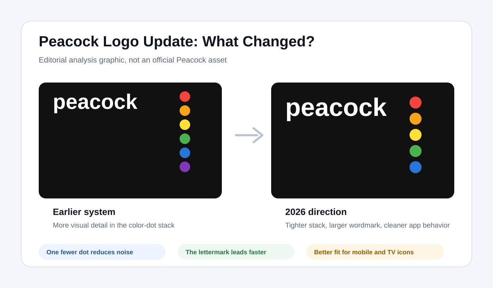

<article>
  
Peacock 最近更新了它的流媒体品牌 Logo。和彻底换标不同，这次更新更像一次“数字产品级优化”：字标更清晰，App 图标更扁平，原本跟随字母的一列彩色圆点减少了一个。

  <figure>
    
    <figcaption>Peacock 2026 新Logo。图片来源：Wikimedia Commons / NBCUniversal。</figcaption>
  </figure>

  <h2>Peacock Logo 更新了哪些地方？</h2>

  
这次变化集中在几个细节：小写“p”的存在感更强，圆点组合更紧凑，图标效果更平面化。尤其是圆点数量减少之后，整体标识在小尺寸下会更容易识别。

  <figure>
    
    <figcaption>编辑分析图：更少的视觉噪音、更突出的字标、更适合App图标的比例。</figcaption>
  </figure>

  <figure>
    
    <figcaption>Peacock 旧Logo。新版本不是推翻原识别资产，而是做了更适合屏幕的精简。</figcaption>
  </figure>

  <h2>为什么少一个圆点是关键？</h2>

  
Peacock 的彩色圆点连接着 NBC 经典孔雀符号，是品牌记忆的一部分。但在手机桌面、电视应用、搜索列表、社交头像等场景里，Logo 经常被压缩到很小。细节越多，识别成本就越高。

  
减少一个圆点，可以让字母“p”和色彩符号之间的关系更稳定。这不是减少品牌个性，而是把视觉重点放在更容易被用户记住的地方。

  <h2>流媒体Logo越来越像“产品图标”</h2>

  
流媒体品牌不再只出现在广告海报和片头动画里，它们每天都要在各种屏幕入口中竞争注意力。一个成熟的流媒体 Logo，必须同时适合电视大屏、手机小图标、社交媒体头像和内容角标。

  <figure>
    
    <figcaption>Peacock 图标版本。小尺寸识别，是这次更新的重要目标。</figcaption>
  </figure>

  <h2>普通品牌可以学到什么？</h2>

  
如果你的品牌已经有一定认知，升级 Logo 不一定要完全推翻原来的设计。更值得先检查的是：小尺寸是否清晰？图形和字标能否拆开使用？在深浅背景下是否稳定？在 App、网站、名片、门头等不同场景里是否统一？

  
Peacock 这次更新说明，好的 Logo 优化往往不是“更复杂”，而是更好用、更清楚、更适合真实场景。

  
<strong>如果你也想设计一个适合网站、App和品牌物料的Logo，</strong>可以访问 <a href="https://www.logomaker.com.cn/">标智客Logo设计工具</a>，输入品牌名称和行业，快速生成属于自己的Logo方案。

</article>
